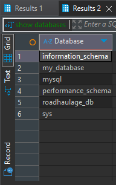
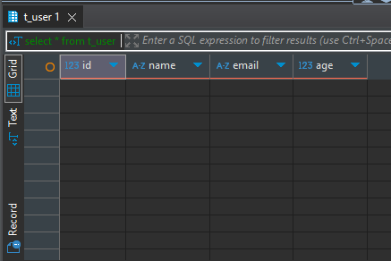
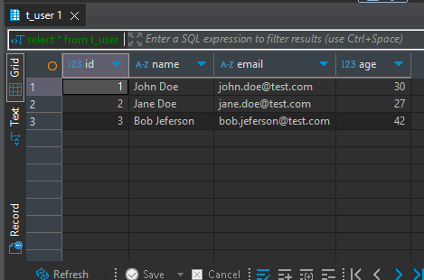
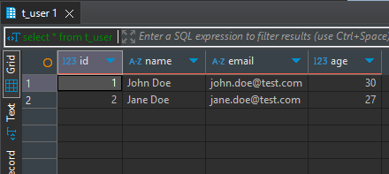

# Work with database(mySQL)

---
### Task

1. I created database `my_database`



2. I created table `t_user` with fields:
   1. `id` - INT, AUTO_INCREMENT, PRIMARY KEY
   2. `name` - VARCHAR(256)
   3. `age` - INT
   4. `email` - VARCHAR(256)



3. I insert some data(name, email, age) in table
   1. 'John Doe', 'john.doe@test.com', 30
   2. 'Jane Doe', 'jane.doe@test.com', 27
   3. 'Bob Jeferson', 'bob.jeferson@test.com', 42
4. I went through all the data from the table



5. I deleted user with name `Bob` and checked and verified 
that the code was executed correctly


--- 
### Full script
```
create database my_database;

show databases;

use my_database;

create table t_user(
	id INT auto_increment primary key,
	name varchar(256) not null,
	email varchar(256) not null,
	age INT not null
);

select * from t_user;

insert into t_user(name, email, age) values
('John Doe', 'john.doe@test.com', 30),
('Jane Doe', 'jane.doe@test.com', 27),
('Bob Jeferson', 'bob.jeferson@test.com', 42);

select * from t_user;

delete from t_user where name like '%Bob%';

select * from t_user;
```